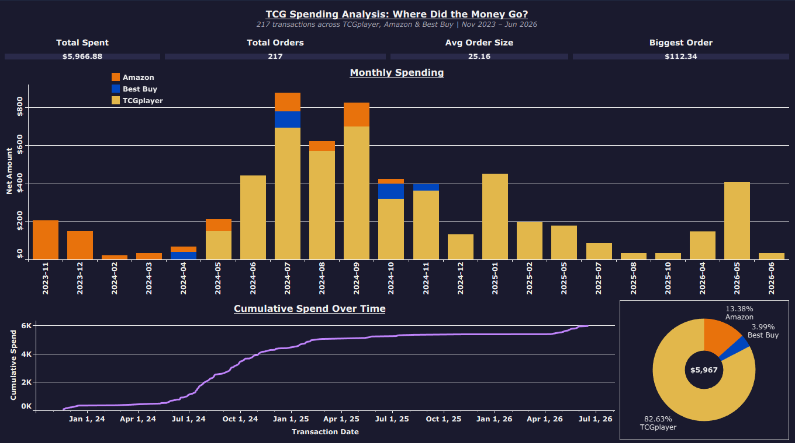
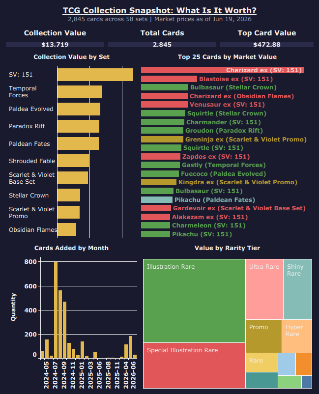
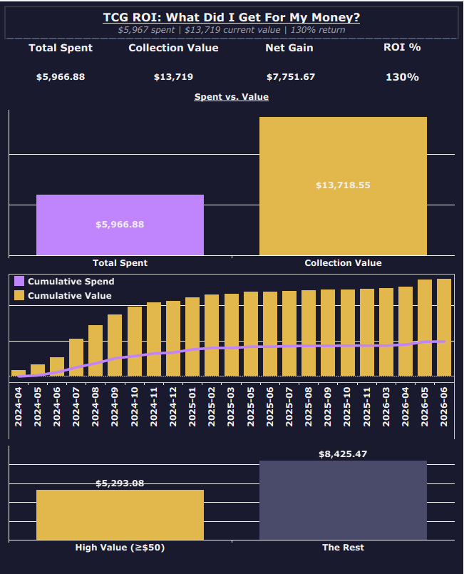

# 🃏 TCG Spending & Collection Analysis: Where Did the Money Go?

**Personal Hobby Analysis | Tools: Python, Tableau, Manual Data Collection**

---

## The Story

It started with my son Grayson.

When my little boy Grayson got into Pokémon cards, I got into them too. That's just kind of how it goes. We'd go to Target, hit up Best Buy, order stuff off Amazon and TCGplayer — chasing sets, pulling packs, building a collection together. It was genuinely fun, and honestly still is.

Then the market got weird. Cards that used to sit on shelves started disappearing. Prices jumped. The hobby got harder to access in the casual way it used to be. I scaled back the buying, but I never stopped tracking what I had. Everything stayed logged in Collectr — a card collection app I'd been using to catalog the collection as it grew.

Fast forward to now. I hadn't bought much in a while, but I kept an eye on the Collectr values here and there. And over the past year? The cards absolutely took off. Sets I bought at retail are now worth multiples of what I paid. The 151 Charizard ex SIR I picked up? Sitting at $472. The Greninja EX collection I grabbed from Amazon for $29.99? That promo card alone is worth over $120 today.

So I did what any data analyst would do — I pulled the receipts. Literally.

---

## The Data Angle

This project is a personal one, but it's also a demonstration of something I think is underappreciated: **data is everywhere in your own life.** You don't need a corporate database or a Kaggle dataset to do real analysis. You need to look around.

Here's what I used:
- **Chase bank CSV export** — 189 TCGplayer transactions going back to May 2024, pulled straight from my online banking
- **Amazon order screenshots** — manually reviewed my order history and extracted Pokémon purchases one by one, building a clean dataset from raw screenshots
- **Best Buy purchase history** — same manual approach, pulled from my Best Buy account
- **Collectr CSV export** — a full snapshot of my 2,845-card collection with today's market prices, exported directly from the app

No synthetic data. No sample datasets. Just my actual spending, my actual cards, my actual numbers.

The result is three dashboards that tell the full story — what I spent, what I have, and what it's worth now.

---

## A Note on Data Cleaning

One thing worth calling out: the raw Chase CSV exports contain bank account metadata that should never be shared publicly. The ETL scripts strip all of that down to dates, amounts, and transaction types only. The raw bank files live in a local `csv PII (NOT TO BE UPLOADED)` folder and are excluded from this repo entirely. What gets committed is only the cleaned, anonymous output.

Additionally, one transaction was intentionally excluded from the analysis — a May 2026 TCGplayer purchase that was a gift for my boy Grayson. It's a real transaction but it's not part of my personal collection story, so it was removed during the ETL process and documented as a data cleaning decision.

---

## Dashboard 1 — TCG Spending Analysis: Where Did the Money Go?

**[View on Tableau Public](https://public.tableau.com/app/profile/bryce.gardner/viz/tcg-spending-collection-analysis/TCGSpendingAnalysisWhereDidtheMoneyGo)**

The spending story. 217 transactions across TCGplayer, Amazon, and Best Buy from November 2023 through June 2026.

The bar chart tells the timeline clearly — a slow start in late 2023 as Grayson and I were just getting into it, then a massive ramp-up through mid-2024 as we went deep on sets like 151, Paradox Rift, and Twilight Masquerade. The cumulative spend line hits $6K by mid-2026. The donut confirms what you'd expect: TCGplayer is where most of the card money goes (82.6%), with Amazon and Best Buy filling in the gaps for sealed product.

**Key numbers:**
- Total spent: $5,966.88
- Total orders: 217
- Avg order size: $25.16
- Biggest single order: $112.34

---

## Dashboard 2 — TCG Collection Snapshot: What Is It Worth?

**[View on Tableau Public](https://public.tableau.com/app/profile/bryce.gardner/viz/tcg-spending-collection-analysis/TCGCollectionSnapshotWhatIsItWorth)**

The collection as it stands today. 2,845 cards across 58 sets, valued at current market prices as of June 19, 2026.

SV: 151 is the clear king — over $2,350 in value from a single set. The top 20 cards by value are a mix of Special Illustration Rares, Illustration Rares, and Promos — exactly the cards that were retail-priced when I bought them and have since gone wild. The rarity tier treemap shows Illustration Rare carrying a huge share of total value, which makes sense given how the market has moved on those cards.

The collection growth chart shows the big logging push in mid-2024 — that's when I really got serious about tracking everything in Collectr.

**Key numbers:**
- Total collection value: $13,719
- Total cards: 2,845
- Top single card: Charizard ex (SV: 151) — $472.88

---

## Dashboard 3 — TCG ROI: What Did I Get For My Money?

**[View on Tableau Public](https://public.tableau.com/app/profile/bryce.gardner/viz/tcg-spending-collection-analysis/TCGROIWhatDidIGetForMyMoney)**

The money shot. $5,967 spent. $13,719 current value. $7,751 net gain. 130% return.

The side-by-side bar chart makes the story impossible to miss — the gold collection value bar towers over the purple spend bar. The cumulative chart beneath it shows how value accumulated faster than spending the whole way through. Even during the quiet period when I wasn't buying much, the cards I already owned kept going up.

The high value breakdown shows that just 62 cards (≥$50 each) account for $5,293 of the total $13,719 value. The remaining 2,783 cards make up the other $8,425. It's a both/and situation — the big hits matter, but so does the depth of the collection.

Pokémon cards get a bad rap sometimes as a frivolous hobby. But when you run the actual numbers? It's been both fun and financially sound. That's a pretty rare combination.

---

## Technical Details

**Data Sources:**
- Chase bank CSV (TCGplayer transactions, May 2024 – June 2026)
- Amazon order history (manual screenshot extraction, Nov 2023 – Nov 2024)
- Best Buy purchase history (manual screenshot extraction, Apr 2024 – Nov 2024)
- Collectr CSV export (collection snapshot, June 19, 2026)

**ETL Pipeline:**
- `tcg_spending_etl.py` — cleans Chase CSV, flips amounts positive, derives date columns
- `amazon_bestbuy_etl.py` — builds clean CSV from manually logged Amazon/Best Buy data
- `collectr_etl.py` — cleans Collectr export, applies data corrections (Drowzee IR qty fix), adds derived columns including rarity tier groupings and high value flag
- `roi_monthly_combined.py` — merges monthly spending and collection value into unified time series for ROI dashboard

**Output CSVs:**
- `tcg_spending_clean.csv` — 200 rows, TCGplayer transactions
- `amazon_bestbuy_tcg_clean.csv` — 33 rows, Amazon and Best Buy purchases
- `tcg_all_spending_combined.csv` — 233 rows, all sources merged
- `collection_clean.csv` — 2,805 rows, full collection with market values
- `roi_monthly_combined.csv` — 23 rows, monthly spend vs value time series
- `roi_scaffold.csv` — 2 rows, scaffold for Money Shot viz

---

## If You Liked This...

This project sits alongside some other analyses in my portfolio where I've dug into financial and business data with a personal angle:

| Project | Description | Link |
|---|---|---|
| 🍽️ Four Tiers, One Century | A century of restaurant industry evolution across four business tiers | [GitHub](https://github.com/brycegardner90/restaurant-industry-analysis) |
| 🎬 Carmike Cinemas | Rise, fall, and acquisition of a regional theater chain — an employer I actually worked for | [GitHub](https://github.com/brycegardner90/carmike-cinemas-analysis) |
| 🌮 On The Border | 40+ years of growth, neglect, and collapse in the casual dining space | [GitHub](https://github.com/brycegardner90/on-the-border-analysis) |
| 🍣 Kona Grill | The story of a concept that got too big too fast | [GitHub](https://github.com/brycegardner90/kona-grill-analysis) |
| 🏘️ The Forsyth Boom | Population and business growth in one of Georgia's fastest-growing counties | [GitHub](https://github.com/brycegardner90/Forsyth-Boom) |

**Full portfolio:** [github.com/brycegardner90](https://github.com/brycegardner90) | **LinkedIn:** [linkedin.com/in/bryce-gardner-16a889183](https://linkedin.com/in/bryce-gardner-16a889183)
